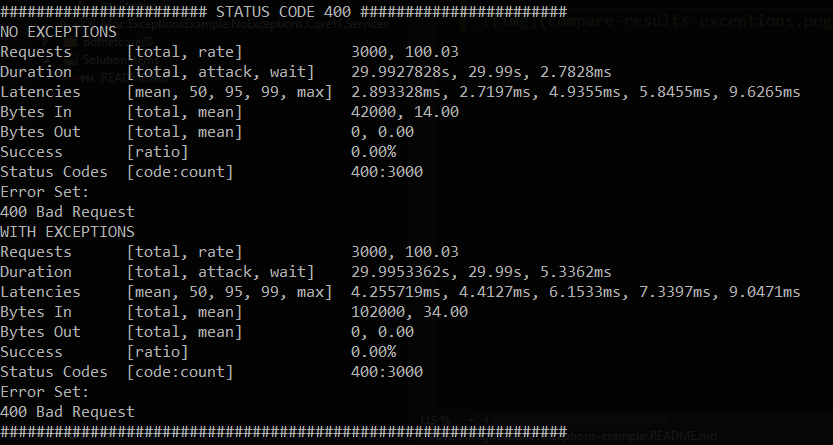
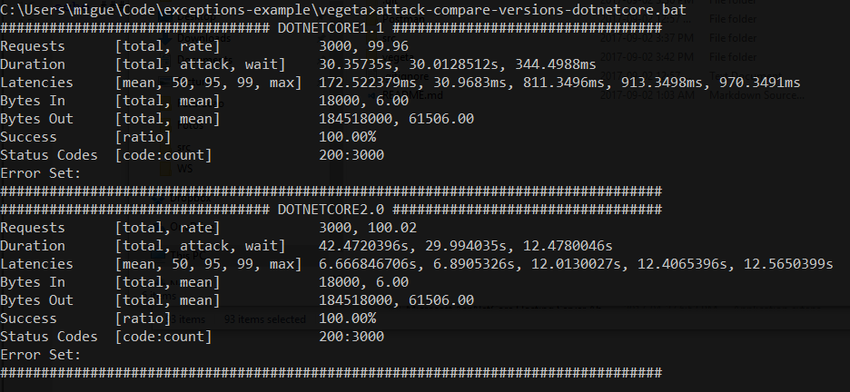

# Exceptions Example

Projeto com três APIs:

1. Utiliza Exceptions (`Mpc.ExceptionsExample.WithExceptions.Api`)
2. Não utilizado Exceptions (`Mpc.ExceptionsExample.NoExceptions.Api`)
3. Em DotNetCore 1.1 (`Mpc.ExceptionsExample.NoExceptions.Core11.Api`)

Cada api tem apenas o endpoint:

- POST api/values

O endpoint recebe um array de `int` e devolve a soma de todos os elementos.

Exemplo:

```
POST /api/values HTTP/1.1
Host: localhost:8103
Content-Type: application/json

[1,2,3,4,5,6,7,8,9,10,11,12,13,14,15,16,16,18,19,20]
```

A grande diferença entre as API é que no caso de a lista ser vazia.

Na API `WithExceptions` é devolvido um BadRequest através do lançamento de um `Exception` no 
serviço responsável por fazer o cálculo.

Exemplo da API `WithExceptions`:

```c#
public IActionResult Post([FromBody] IEnumerable<int> values)
{
    try
    {
        var serviceResult = _valuesService.ProcessValues(values);
        return Ok(serviceResult);
    }
    catch (ArgumentException ex)
    {
        return BadRequest(ex.Message);
    }
}
```

Enquanto que na API `NoExceptions` é feita a verificação se o array tem ou não elemendos.

Exemplo da API `NoExceptions`:

```c#
public IActionResult Post([FromBody] IEnumerable<int> values)
{
    var serviceResult = _valuesService.ProcessValues(values);
    if (!serviceResult.Success)
    {
        return BadRequest(serviceResult.Messages);
    }

    return Ok(serviceResult.Result);
}
```

## Resultados

### NoExceptions vs Exceptions

O objetivo é fazer pedidos às API com a lista vazia, ou seja, a resposta tem de ser `BadRequest`.

Utilizando a ferramente [vegeta](https://github.com/tsenart/vegeta), fizemos pedidos durante 30seg com rate=100.



Através dos resultados obtidos, podemos dizer que a API que lança `Exceptions` demora em média mais tempo a responder.


### .Net Core 2.0 vs .Net Core 1.1

O objetivo é comparar duas APIs que fazem exatamente o mesmo mas estão em versões .Net Core diferentes.

O pedido consiste em enviar uma array de inteiros ([ficheiro input](vegeta/input.json)) e a resposta é a soma dessa lista.



Através dos resultado sobtidos, podemos dizer que surpreendemente a API em .Net Core 1.1 tem 
um tempo de resposta médio (2.893328ms) inferior à API em .Net Core 2.0 (4.225719ms).

## Folders

- `Postman`: ficheiros para importar no Postman de forma a simular os pedidos
- `vegeta`: permitir simular vários request em simultâneo. Utilizar os ficheiros `.bat`.
